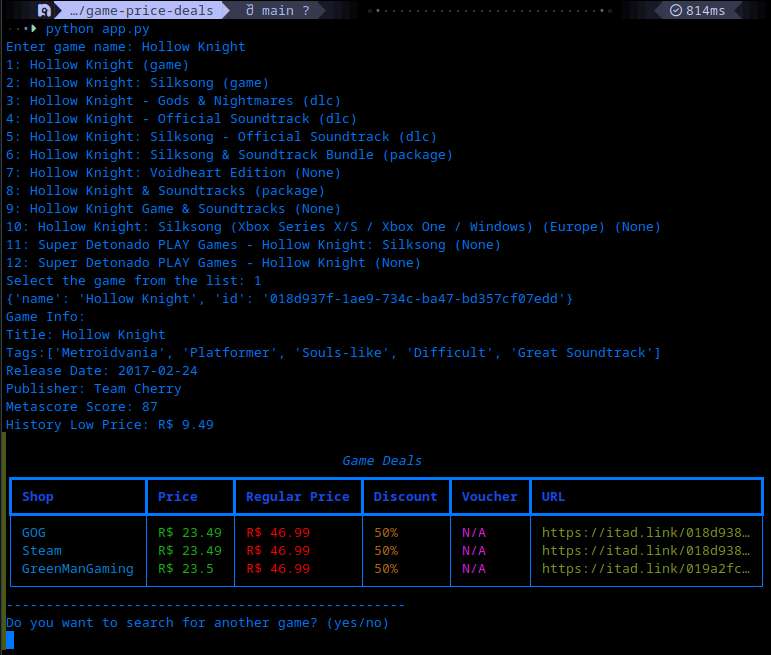

# Game Price Deals



> A simple Python project to fetch Game Deals from Is There Any Deal API.

## ⚙️ Project Structure

```bash
game-price-deals/
├── docs/                  # Screenshots and documentation images
├── .gitignore
├── app.py                 # App functions and scripts
├── requirements.txt       # Python dependencies
├── LICENSE
└── README.md
```

## 🔧 Used Tools

> [!IMPORTANT]
> - Python
> - Rich
> - Requests

## 🍴 How to Run Locally

- First thing you've got to do is fork the project to use on your own repository, this way you can change the project the way you want
- After forking and cloning, you open the project in your terminal and create a virtual environment (venv)
- Run venv

Commonly used command in terminal:

```bash
venv/scripts/activate
```

or 

```bash
source venv/bin/activate
```

- You'll need to use a few dependencies in order for the project to work correctely, you can use the command below

```bash
pip install rich dotenv 

- Create a .env file with API Key you can get in IsThereAnyDeal site (You need to create an account on the site).

- After everything is set-up, you go back to your terminal and run the command:

```bash
python app.py
```

- The project now should be working fine through your terminal

## ✅ Future Intended Updates


## ⚖️ License

MIT

IsThereAnyDeal Website:
[IsThereAnyDeal][https://isthereanydeal.com/apps/] 
